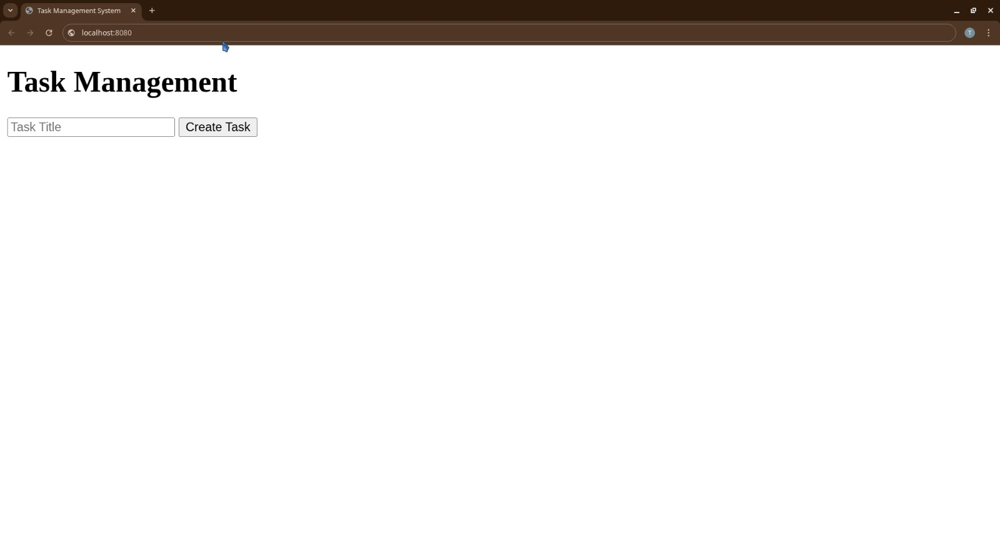
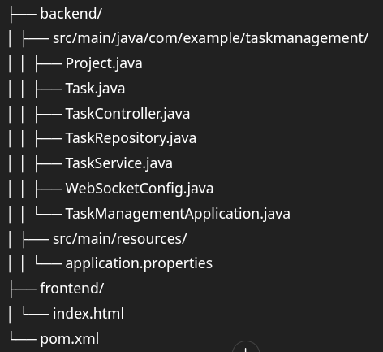

# Assessment-3

# 📝 Task Management System with WebSocket and MongoDB

This is a full-stack Task Management System built with **Spring Boot**, **MongoDB**, and **WebSocket** for real-time updates. The frontend is a simple HTML page (can be extended with any JS framework).



---

## 📌 Features

- ✅ Add, update, delete tasks
- 🔄 Real-time task updates using WebSocket
- 🗂 MongoDB for persistent storage
- 🔧 RESTful API for task management

---

## ⚙️ Tech Stack

- **Backend:** Spring Boot, WebSocket, MongoDB
- **Frontend:** HTML (extendable with React, Angular, etc.)
- **Build Tool:** Maven

---

## 🗂 Project Structure




---

## ⚡ Getting Started

### 1. Clone the Repository
```bash
git clone https://github.com/Anjali210a/Assessment-3.git
cd task_management_system_with_websocket/backend
```

---

### 2. Configure MongoDB
#### Update your application.properties:

```
spring.data.mongodb.uri=mongodb://localhost:27017/taskdb
server.port=8081
```

---

### 3. Build and Run Backend
```
mvn clean install
mvn spring-boot:run
```
The backend will start on `http://localhost:8081`

---

### 4. WebSocket Endpoint
#### WebSocket endpoint is available at:
```
ws://localhost:8081/ws
```
You can register your handler in WebSocketConfig.java.

---


